# Ilmanlaadun ja kunnossapidon korrelaatio

## Tiivistelmä

## Sisältö

-   [Ilmanlaadun ja kunnossapidon korrelaatio](#ilmanlaadun-ja-kunnossapidon-korrelaatio)
    -   [Tiivistelmä](#tiivistelmä)
    -   [Sisältö](#sisältö)
    -   [Johdanto ja toimeksianto](#johdanto-ja-toimeksianto)
    -   [Käytettävä data](#käytettävä-data)
        -   [Digitrafficin rajapinta](#digitrafficin-rajapinta)
            -   [Tietoa rajapinnasta](#tietoa-rajapinnasta)
            -   [Rajapinnan käyttö tutkimuksessa](#rajapinnan-käyttö-tutkimuksessa)
            -   [LAM-data](#lam-data)
        -   [Ilmatieteen laitos](#ilmatieteen-laitos)
            -   [Tietoa](#tietoa)
            -   [Latauspalvelu](#latauspalvelu)
            -   [Datan formaatti](#datan-formaatti)
    -   [Ilmanlaatuun vaikuttavat tekijät ja määritelmä](#ilmanlaatuun-vaikuttavat-tekijät-ja-määritelmä)
        -   [Ilmanlaadun määritelmä](#ilmanlaadun-määritelmä)
        -   [Harjaus ja katupöly](#harjaus-ja-katupöly)
    -   [Harjausdata](#harjausdata)
        -   [Datan sisältö](#datan-sisältö)
        -   [Harjausdata kartalle](#harjausdata-kartalle)
    -   [Raja-arvojen ylitykset](#raja-arvojen-ylitykset)
        -   [Ylitykset](#ylitykset)
        -   [Ylitykset ja harjaus](#ylitykset-ja-harjaus)
        -   [Aiemmat vuodet](#aiemmat-vuodet)
    -   [Ilmanlaatu havaintoasemilla](#ilmanlaatu-havaintoasemilla)
        -   [Harjausdatan yhdistäminen havaintoasemaan](#harjausdatan-yhdistäminen-havaintoasemaan)
        -   [Tutkittavat havaintoasemat](#tutkittavat-havaintoasemat)
        -   [Harjausreitit ja hiukkaspitoisuudet valituilla asemilla](#harjausreitit-ja-hiukkaspitoisuudet-valituilla-asemilla)
    -   [Muut vaikuttavat tekijät](#muut-vaikuttavat-tekijät)
        -   [Sää](#sää)
        -   [Liikenne](#liikenne)
    -   [Pohdinta](#pohdinta)
    -   [Lähteet](#lähteet)

## Johdanto ja toimeksianto

Tutkimuksen toimeksiantona oli selvittää ilmanlaadun ja kunnossapidon mahdollinen korrelaatio. Tutkimuksen toteuttamiseksi tallennettiin dataa Digitraficin rajapinnasta vuoden 2024 kevätkuukausien ajalta ja näiden vaikutusta ilmanlaatuun tutkitiin tarkastelemalla yksittäisien havaintoasemien mittaustuloksia sekä havaintoasemien tuottamia hiukkaspitoisuuksien raja-arvojen ylityksiä valtakunnallisella tasolla. Muita ilmanlaatuun vaikuttavia tekijöitä pyrittiin myös tarkastelemaan hyödyntämällä säästä ja liikennemääristä saatavilla olevaa dataa. Tutkimus keskittyy PM10 hiukkaspitoisuuksiin, johon harjauksella ja katupölyllä on saatavilla olevista ilmanlaatusuureista isoin vaikutus.

## Käytettävä data

### Digitrafficin rajapinta

#### Tietoa rajapinnasta

Rajapinta on Fintrafficin operoima palvelu nimeltä Digitraffic. Palvelu sisältää reaaliaikaista informaatiota sovelluskehitykseen liikenteestä tieltä, mereltä ja rautateiltä. (Digitraffic n.d.) Rajapinta on Digitrafficin tieliikenteen maanteiden kunnossapidon REST-ohjelmointirajapinta, joka lähettää data JSON-formaatissa. Rajapinta käyttää [GeoJSON](https://datatracker.ietf.org/doc/html/rfc7946) formaattia. Aikadatan muoto on [ISO 8601](https://en.wikipedia.org/wiki/ISO_8601) ja aika koordinoitu yleisaika (UTC).

Datasnipetti:

```
{
  "type" : "FeatureCollection",
  "dataUpdatedTime" : "2024-04-04T09:51:53Z",
  "features" : [ {
    "type" : "Feature",
    "properties" : {
      "id" : 100491500,
      "previousId" : 100490627,
      "sendingTime" : "2024-04-03T09:50:14Z",
      "created" : "2024-04-03T09:52:32Z",
      "tasks" : [ "BRUSHING" ],
      "startTime" : "2024-04-03T09:50:15Z",
      "endTime" : "2024-04-03T09:52:16Z",
      "direction" : null,
      "domain" : "state-roads",
      "source" : "Harja/Väylävirasto"
    },
    "geometry" : {
      "type" : "LineString",
      "coordinates" : [ [ 23.243227, 61.552086, 0.000000 ], [ 23.244139, 61.551499, 0.000000 ], [ 23.245490, 61.550161, 0.000000 ], [ 23.246641, 61.549394, 0.000000 ] ]
    }
  }, {
    ...
  },
  ...
  ]
}
```

#### Rajapinnan käyttö tutkimuksessa

Tutkimuksessa Digitrafficin tieliikenteen rajapintaa käytettiin tallentamaan dataa maanteiden kunnossapidosta. Rajapinnasta tallennettiin harjauskaluston suorittamat reitit 5.3.2024 alkaen. Tallennus toteutettiin klo 12 paikallista aikaa JAMK:n student palvelimen virtuaalisella Linux ympäristöllä seuraavasta rajapinnasta: https://tie.digitraffic.fi/api/maintenance/v1/tracking/routes?taskId=BRUSHING. Kunnossapitodata on rajattu harjauskaluston suorittamiin reitteihin parametrillä `?taskId=BRUSHING`.

#### LAM-data

Digitraffic tarjoaa myös [LAM-tilastohaun](https://tie.digitraffic.fi/ui/tms/history/), jota käytettiin liikennemäärien tarkasteluun eri havaintoasemien lähettyvillä. Soveltuvat datapisteet valittiin [Lam Datapisteet](http://aida.labranet.jamk.fi/lam-visualization/)-sovelluksen avulla. LAM-dataa on saatavilla liikennemäärinä ajoneuvotyypeittäin, raakadatana ja keskinopeusdatana. Tutkimuksen tapauksessa hyödynnettiin raakadatahavaintoja, josta hyödynnettiin tunnin liikennemääriä sekä päivittäisiä liikennemääriä.

### Ilmatieteen laitos

#### Tietoa

[Ilmatieteen laitos](https://www.ilmatieteenlaitos.fi/) on liikenne- ja viestintäministeriön hallinnonalainen ilmakehää, lähiavartuutta ja meriä havainnoiva ja tutkiva laitos. (Ilmatieteen laitos - turvaa ja sujuvuutta yhteiskunnalle n.d.)

#### Latauspalvelu

Ilmatieteen laitoksen palvelu [Havaintojen lataus](https://www.ilmatieteenlaitos.fi/havaintojen-lataus) mahdollistaa sää-, säteily-, meri ja ilmanlaatuhavaintojen lataamisen.
Latauspalvelu mahdollistaa ilmanlaatuhavaintojen lataamisen tuntihavaintoina eri ilmanlaatuindeksiin vaikuttavista suureista. Havaintoja on saatavilla niin kaupunkien tuottamina kuin Ilmatieteen laitoksen omina havaintoina. Latauspalvelun ilmanlaatuhavaintojen suureet ovat edellisen tunnin keskiarvoja. (Havaintojen lataus n.d.; Lisätietoja havaintosuureista n.d.)

Tutkimuksessa tultaisiin hyödyntämään myös muita latauspalvelun tarjoamia suureita, kuten eri suureita säähavainnoista.

#### Datan formaatti

Latauspalvelu tarjoaa dataa .xlxs-,.csv- ja .html-formaateissa. Tutkimuksessa käytettävän PM10 CSV-datan (UTC) formaatti oli seuraava:

```
"Havaintoasema","Vuosi","Kuukausi","Päivä","Aika [UTC]","Hengitettävät hiukkaset <10 µm [µg/m3]"
"Virolahti Harju","2024","3","16","11:00","22.8"
"Virolahti Harju","2024","3","16","12:00","22.4"
"Virolahti Harju","2024","3","16","13:00","23.2"
...
```

## Ilmanlaatuun vaikuttavat tekijät ja määritelmä

### Ilmanlaadun määritelmä

Ilmanlaadun määrittelemiseksi Ilmatieteen laitos käyttää ilmanlaatuindeksiä. Indeksi luokitellaan laatusanoihin hyvä, tyydyttävä, välttävä, huono tai erittäin huono. Laskennassa hyödynnetään rikkidioksidin (SO₂), typpidioksidin (NO₂), hengitettävien hiukkasten (PM₁₀ ), pienhiukkasten (PM₂.₅), otsonin (O₃) ja haisevien rikkiyhdisteiden (TRS) pitoisuuksia. (Ilmanlaatuindeksi n.d.)

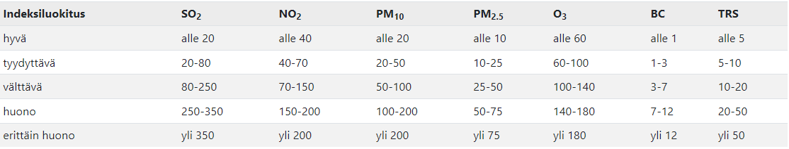

Kuvio 1. Ilmatieteen laitoksen tuntipitoisuutta (µg/m3) vastaavat indeksiarvot (Ilmanlaatuindeksi n.d.)

### Harjaus ja katupöly

Tutkimuksen hypoteesina on, että harjaus heikentää ilmanlaatua harjattavan alueen läheisyydessä. Harjauskalusto on kuitenkin kehittynyt vuosien saaatossa ja harjaukseen käytettävät laitteet keräävät ja kastelevat maassa olevaa hiekkaa pölyämisen estämiseksi. Harjauksen voisi myös olettaa parantavan ilmanlaatua pidemmällä aikavälillä, kun katupöly on poistettu teiltä.

Koska ilmanlaatuindeksiin vaikuttavat useat suureet, täytyi suureet rajata katupölyn vaikuttamiin suureisiin. HSY:n tiedotteessa todetaan katupölyn vaikuttavan erityisesti hengitettävien hiukkasten PM10 pitoisuuksiin, mutta pienhiukkasten PM2,5 kokoluokkaan kuuluu vain pieni osa katupölystä. Tiedotteessa todetaan ilmanlaadun heikkenevän erityisen huonoksi kevätpuhdistuksen aikana, kun sää on kuivaa ja tyyntä. (Katupöly heikentää ilmanlaatua n.d.)

Kaikki PM-10 hiukkaset eivät kuitenkaan ole katupölyä. Ritolan, Kulovuoren, Stojiljkovicin ja Karvosenojan (2021) mukaan FRES-mallinnuksella katupölypäästöt muodostivat 34% PM-10 päästöistä ja 5,5% PM2,5-kokonaispäästöistä.

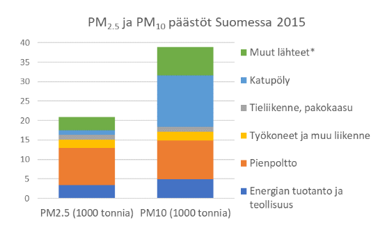

Kuvio 2. Pienhiukkasten (PM2,5) ja hengitettävien hiukkasten (PM10) ihmisperäiset kokonaispäästöt
pääsektoreittain Suomessa vuonna 2015. Katupölypäästöt on esitetty vaalean sinisellä. \*Muut lähteet
sisältävät mm. maataloudesta, turpeen tuotannosta, rakennustoiminnasta ym. syntyvät pölypäästöt. (Ritola ym. 2021.)

Ilmanlaatudataa tarkasteltaessa tulisi myös huomioida havaintoaseman sijainti suhteessa vilkasliikenteisiin teihin. Kuviossa 3 on kuvattu Jyväskylän Hannikaisenkadulla sijaitsevan mittausaseman hiukkasten pitoisuudet eri ilmansuunnilla. Kuviosta erottuu selvästi runsasliikenteisten väylien suunnat.

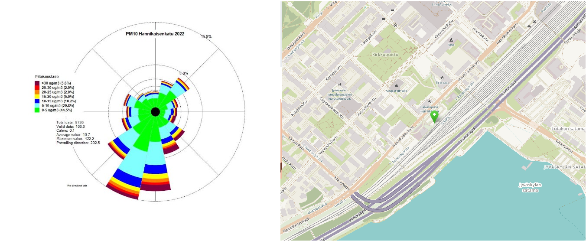

Kuvio 3. Hengitettävien hiukkasten pitoisuudet eri tuulensuunnilla Hannikaisenkadulla vuonna 2022. (Pärjälä. 2023. muokattu)

Katupöly on mahdollista havaita silmämääräisesti keväisin. Silmämääräisesti havaittavissa oleva pöly on kuitenkin kokoluokaltaan suuriin hiukkasiin lukeutuvia hiukkasia, joiden halkaisija on yli 10 mikrometriä. Nämä hiukkaset aiheuttavat tyypillisesti ärsytysoireita, kuten nuhaa, yskää ja kurkun sekä silmien kutinaa. Suurien hiukkasten pitoisuutta ei pystytty tutkimaan, sillä kyseisen kokoluokan hiukkasista ei ole saatavilla dataa. Suurin osa katupölystä on kuitenkin hengitettävien hiukkasten eli alle 10 mikrometrin kokoluokkaa. (Hengitysilmassa on aina erikokoisia hiukkasia n.d.)

Kuviossa 4 on kuvattu Ritolan ja muiden mittaustulokset harjausta ennen ja harjauksen jälkeen. Kuviosta voi havaita hengitettävien hiukkasten pitoisuuksien laskevan katutasossa harjauksen jälkeen, mutta nousevan aiemmalle tasolle jo seuraavana päivänä. (Ritola ym. 2021.)

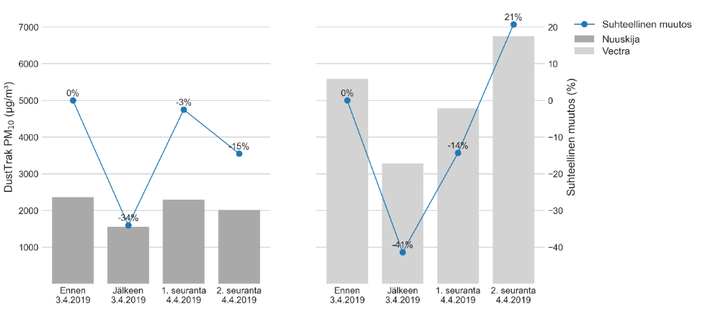

Kuvio 4. Nuuskijan (vasen) ja Vectran (oikea) mittaamien PM10-päästöjen absoluuttiset (palkit, vasen
pystyakseli) ja suhteelliset (viiva, oikea pystyakseli) muutokset ennen ja jälkeen pesun Snowek Trombi-
alla. 1. ja 2. seuranta on tehty pesua seuraavana päivänä. (Ritola ym. 2021.)

Raportin tutkimus käyttää havaintoasemien mittausdataa, joka varmasti poikkeaa tienpinnan läheisyydestä mitatatuista pitoisuuksista. Tämän lisäksi Siposen, Taimiston, Yli-Tuomen ja Salosen (2021) mukaan kävelijän altistuminen pienhiukkasille ja hengitettäville hiukkasille on huomattavasti korkeampi kuin pitoisuusarvot mittausasemilla.

## Harjausdata

### Datan sisältö

Tallennusmenetelmästä ja datan formaatista johtuen, dataa esikäsiteltiin käytettävämpään muotoon poistamalla JSON-datan sisäkkäiset rakenteet ja tallennusmenetelmästä johtuvat muutamat toistuvat reitit. Alkuperäinen JSON-data säilytettiin kuitenkin GeoJSONia tukevan GeoPandas kirjaston käytön helpoittamiseksi.

Dataframe:

<div>
<table border="1" class="dataframe">
  <thead>
    <tr style="text-align: right;">
      <th></th>
      <th>id</th>
      <th>previousId</th>
      <th>sendingTime</th>
      <th>created</th>
      <th>tasks</th>
      <th>startTime</th>
      <th>endTime</th>
      <th>direction</th>
      <th>domain</th>
      <th>source</th>
      <th>type</th>
      <th>coordinates</th>
    </tr>
  </thead>
  <tbody>
    <tr>
      <th>0</th>
      <td>97620071</td>
      <td>NaN</td>
      <td>2024-03-12T07:21:51Z</td>
      <td>2024-03-12T07:24:41Z</td>
      <td>[BRUSHING]</td>
      <td>2024-03-12T07:21:50Z</td>
      <td>2024-03-12T07:23:52Z</td>
      <td>None</td>
      <td>state-roads</td>
      <td>Harja/Väylävirasto</td>
      <td>LineString</td>
      <td>[[23.316789, 60.383224, 0.0], [23.316183, 60.3...</td>
    </tr>
    <tr>
      <th>1</th>
      <td>97620251</td>
      <td>97620071.0</td>
      <td>2024-03-12T07:23:53Z</td>
      <td>2024-03-12T07:26:43Z</td>
      <td>[BRUSHING]</td>
      <td>2024-03-12T07:23:52Z</td>
      <td>2024-03-12T07:26:00Z</td>
      <td>None</td>
      <td>state-roads</td>
      <td>Harja/Väylävirasto</td>
      <td>LineString</td>
      <td>[[23.317848, 60.386554, 0.0], [23.320868, 60.3...</td>
    </tr>
    <tr>
      <th>2</th>
      <td>97620507</td>
      <td>97620251.0</td>
      <td>2024-03-12T07:26:01Z</td>
      <td>2024-03-12T07:28:44Z</td>
      <td>[BRUSHING]</td>
      <td>2024-03-12T07:26:00Z</td>
      <td>2024-03-12T07:28:45Z</td>
      <td>None</td>
      <td>state-roads</td>
      <td>Harja/Väylävirasto</td>
      <td>LineString</td>
      <td>[[23.321282, 60.389294, 0.0], [23.321706, 60.3...</td>
    </tr>
    <tr>
      <th>3</th>
      <td>97620715</td>
      <td>97620507.0</td>
      <td>2024-03-12T07:28:46Z</td>
      <td>2024-03-12T07:30:46Z</td>
      <td>[BRUSHING]</td>
      <td>2024-03-12T07:28:45Z</td>
      <td>2024-03-12T07:31:45Z</td>
      <td>None</td>
      <td>state-roads</td>
      <td>Harja/Väylävirasto</td>
      <td>LineString</td>
      <td>[[23.323785, 60.392231, 0.0], [23.323774, 60.3...</td>
    </tr>
    <tr>
      <th>4</th>
      <td>97621013</td>
      <td>97620715.0</td>
      <td>2024-03-12T07:31:46Z</td>
      <td>2024-03-12T07:33:48Z</td>
      <td>[BRUSHING]</td>
      <td>2024-03-12T07:31:45Z</td>
      <td>2024-03-12T07:34:21Z</td>
      <td>None</td>
      <td>state-roads</td>
      <td>Harja/Väylävirasto</td>
      <td>LineString</td>
      <td>[[23.324694, 60.39549, 0.0], [23.325216, 60.39...</td>
    </tr>
  </tbody>
</table>
</div>

Datan oleellisimpana sisältönä voidaan pitää reitin kestoa ja reitin sijaintia. Kuviossa 5 on kuvattu reitteihin käytetty aika päivän mukaan vuoden 2024 kevään aikana. Ensimmäiset reitit suoritettiin 12.3.2024. Reitteihin käytetty päivittäinen aika kasvoi huhtikuun toisella viikolla huomattavasti ja muutamaa poikkeusta lukuunottamatta alkoi selvästi laskea toukokuun puolivälin jälkeen.

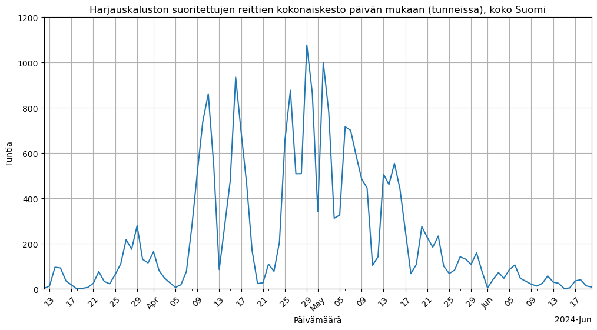

Kuvio 5. Harjauskaluston suoritettujen reittien kokonaiskesto päivän mukaan (tunneissa), koko Suomi.

Luonnollisesti harjauksen aloittamisajankohdassa on alueellisia eroja ilmastosta johtuen. Kuviossa 6 on kuvattu muutaman kaupungin harjaukseen käyttämää aikaa 10 kilometrin säteellä kaupungista. Kuviosta voi huomata harjauksen alkavan ensimmäisenä rannikkokaupungeissa, kuten Turussa, Helsingissä ja Vaasassa jo maaliskuun puolivälissä. Sisämaan kapungeissa, kuten Jyväskylässä ja Tampereella, harjaus alkaa huhtikuun alkupuoliskolla. Tarkasteltavista kaupungeista harjaus alkaa viimeisenä Oulussa aivan huhtikuun lopussa. Harjuksen päättymisellä tai vähenemisellä ei ollut yhtä selkeitä maantieteellisiä eroja.

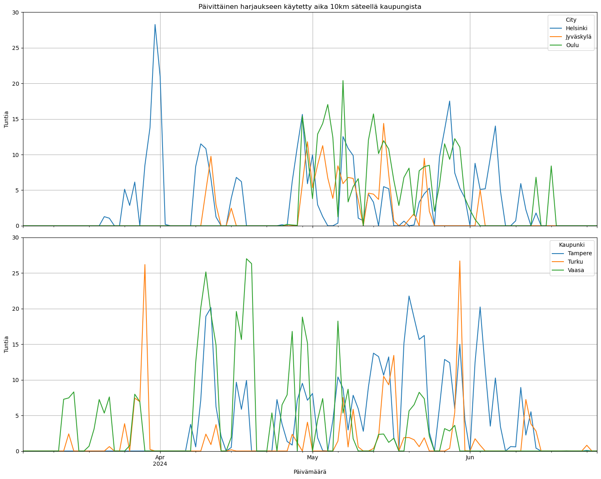

Kuvio 6. Päivittäinen harjaukseen käytetty aika 10km säteellä kaupungista.

Keskimääräisen reitin kestoa pyrittiin myös tarkastelemaan, jolloin huomattiin datan katkonaisuus. Yksittäisen reitin keskimääräinen kesto oli hieman alle puolitoista minuuttia ja mediaani tätäkin matalampi eli hieman yli minuutin. Digitrafficin rajapinnan palauttama reitti on sijaintitietoja yhdistelemällä tuotettu reitti tai piste, jos sijaintitietoja on vain yhdestä pisteestä. Uusi seuranta muodostuu, jos ajoneuvon tehtävä muuttuu, sijantitietojen aikaväli on yli 5 minuuttia tai sijaintitietojen välinen laskennallinen nopeus on yli 140km/h. (Tieliikenne n.d.)

Tarkasteltaessa reittidataa tarkemmin huomattiin yksittäisen reitin datapisteiden vähyys. Kuviossa 7 on kuvattu harjauskaluston suorittamien reittien koordinaattityypit. Reiteistä hieman yli 10% sisältää vain yhden sijaintipisteen ja lopuilla useamman sijaintipisteen reiteillä on vain keskimäärin alle 4 sijaintipistettä. 13.6.2024 mennessä reittejä on hieman yli miljoona ja reittien kokonaiskesto on 972 vuorokautta. Rajapinnan palauttamilla reiteillä on myös mahdollista olla useampi tehtävä. Tallennetuista reiteistä noin kolmasosa sisältää harjauksen lisäksi tehtävän "siltojen puhdistus", joka on yleisin tehtävätyyppi osana harjausdataa. Muita tehtävänimikkeitä esiintyy huomattavasti harvemmin.

| <!-- -->                             | <!-- -->           |
| ------------------------------------ | ------------------ |
| Vektoridatan pisteitä keskimäärin    | 3.8958670952773127 |
| Vektoridatan pisteiden mediaanimäärä | 3.0                |
| Vektoridatan pisteiden maksimimäärä  | 77                 |
| Vektoridatan pisteiden minimimäärä   | 2                  |

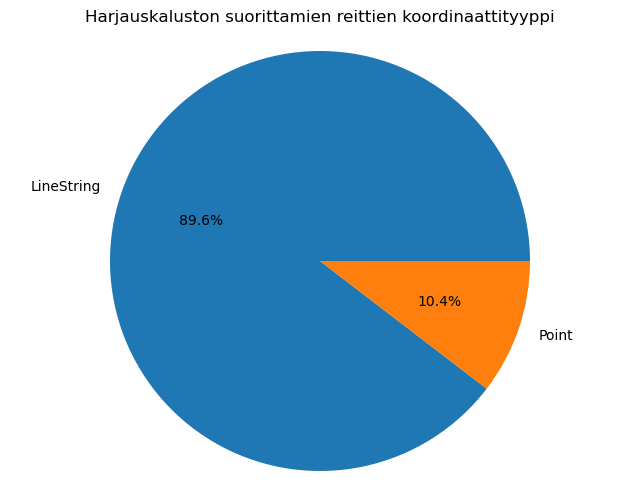

Kuvio 7. Harjauskaluston suorittamien reittien koordinaattityyppi.

### Harjausdata kartalle

Jotta reittien eheyttä ja sijaintia voitaisiin tarkastella sijoitettiin reitit kartalle [GeoPandas](https://geopandas.org/en/stable/)-kirjastolla. Sama kirjasto mahdollistaisi myös näiden reittien etäisyyksien vertailun suhteessa eri havaintoasemiin buffer-, within- ja intersects-metodeilla. Harjausdatan tarkastelua rajoitti alkukeväästä datan vähyys esimerkiksi Jyväskylässä. Kuviossa 8 on kuvattu kevään harjausreitit kartalla.

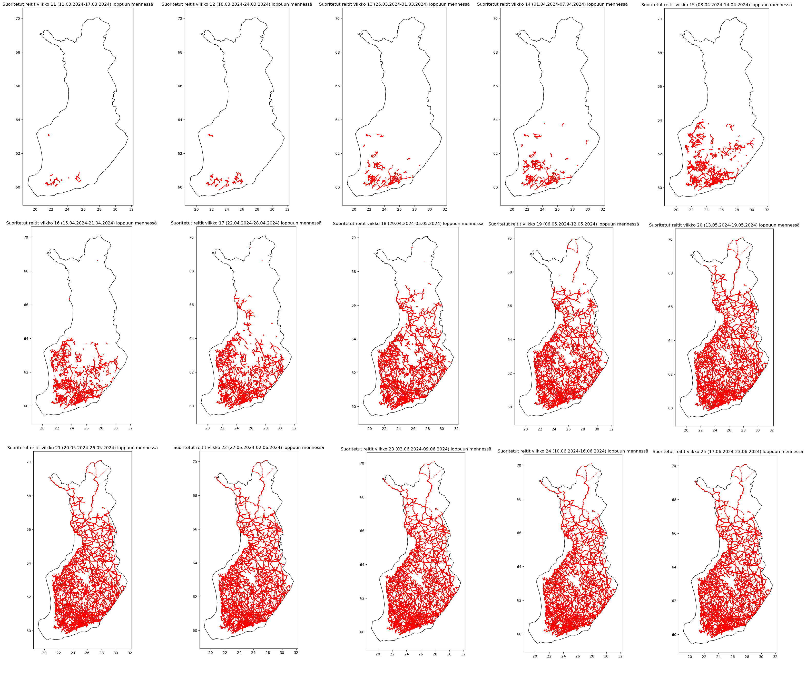

Kuvio 8. Kevään aikana suoritetut kumulatiiviset harjausreitit viikottain kartalla (viikot 11-25).

Reittien eheyttä tarkasteltiin osana toimeksiantoa toteutetulla sovelluksella. Kuviossa 9 on kuvattu harjausreitti [Tienhoito](../app/)-sovelluksessa. Reitti koostuu kolmesta eri reitistä, mutta reitin sijaintitietojen tarkkuus riittää jopa ajettavan kaistan tulkitsemiseen. Reittejä tarkasteltiin sovelluksesta tutkimuksen aikana, eikä huomattavia epätarkkuuksia suhteessa teihin havaittu.

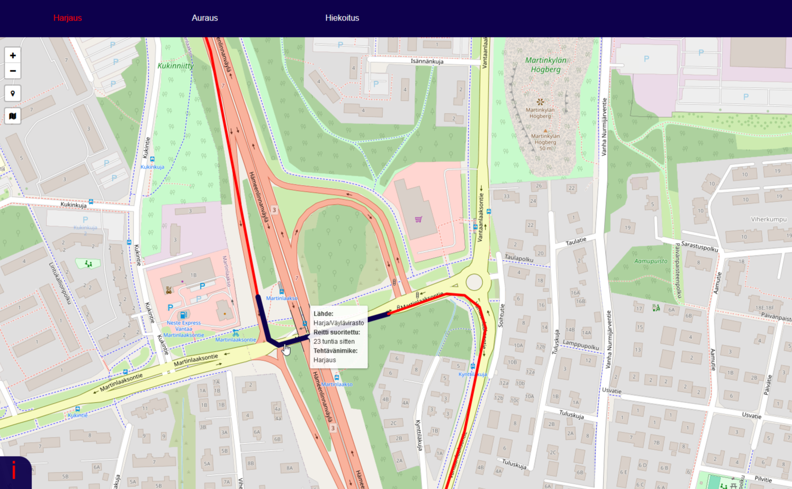

Kuvio 9. Harjausreitti kuvattuna Tienhoito-sovelluksessa.

## Raja-arvojen ylitykset

Harjauksen vaikutusta ilmanlaatuun pyrittiin tutkimaan valtakunnallisella tasolla tutkimalla hiukkaspitoisuuksien raja-arvojen ylityksiä. Raja-rvojen ylitysten tutkiminen mahdollistaisi ilmanlaadullisesti heikkojen päivien tutkimisen valtakunnallisella tasolla ja tämän yhdistämisen Suomessa suoritettuihin harjausreitteihin. Ilmatieteen laitos ylläpitää palvelua raja- ja kynnysarvojen ylityksestä osoitteessa: https://www.ilmatieteenlaitos.fi/ilmanlaadun-uusimmat-ylitykset

Kuviossa 1 esiteltyjen indeksiluokitusten lisäksi Ilmatieteen laitos käyttää erillistä taulukkoa raja-arvojen ylitystyksiin. Kuviossa 10 on kuvattu raja-arvojen ylittymiseen vaaditut rajat eri yhdisteille ja eri aikaväleille. Suomessa yleisin raja-arvon ylittymisen syy ovat hengitettävät hiukkaset katupölyaikaan. (Ilmanlaadun säädökset ja ohjeet. n.d.)

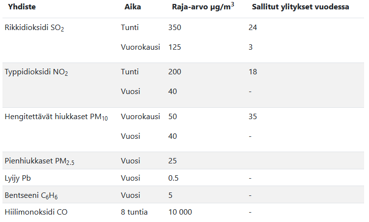

Kuvio 10. Ilmanlaadun raja-arvot. (Ilmanlaadun säädökset ja ohjeet. n.d.)

Ilmatieteen laitos kuvailee raja-arvojen ylityksiä sisältävää datasettiä seuraavalla tavalla:

> Lainsäädännössä ulkoilman/hengitysilman saastepitoisuuksille on asetettu kynnys-, raja- ja ohjearvotasoja, joiden ylittymisestä tulee informoida väestöä. Allaolevissa taulukoissa on listattuna kaikki havaitut ylitykset sekä asema- ja saastekohtainen ylityskertojen lukumäärä kuluvana vuonna. Ilmanlaadun heikentyessä ota ensisijaisesti yhteyttä oman asuinpaikkakuntasi asiantuntijoihin. (Uusimmat ylitykset. 2024.)

Datasettiä tarkasteltaessa täytyisi huomioida raja-arvojen ylitysten sisältävän hengitettävien hiukkasten lisäksi pienhiukkasten raja-arvojen ylityksiä, joihin katupölyllä ei ole niin selvää vaikutusta. Data sisälsi PM10:n vuorokausiraja-arvotason (50 μg/m3) ja PM2.5:n vuorokausiohjearvon (WHO 15 μg/m3) ylityspäivät kullakin havaintoasemalla (Uusimmat ylitykset. 2024.). Tämä tarkoittaisi pitkällä aikavälillä mitattuja heikkoja arvoja, eikä esimerkiksi harjauksen hetkellisesti nostattama pöly välttämättä aiheuttaisi raja-arvon ylitystä.

### Ylitykset

Ylitysten tarkastelu aloitettiin mallintamalla ylityksiä tuottaneet asemat kartalle. Kuviossa 11 on esitetty raja-arvoja ylittäneet asemat ja näiden asemien tuottamien ylitysten määrä. Kuviosta voidaan havaita ylityksien tapahtuvan melko monessa paikassa ja myös isojen kaupunkien ulkopuolella.

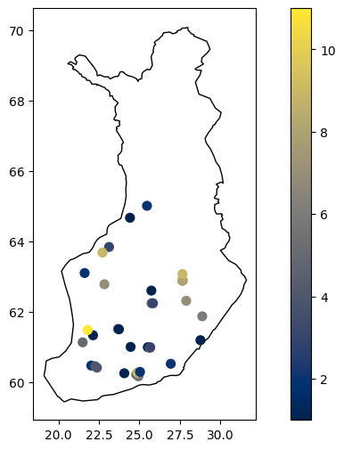

Kuvio 11. Raja-arvojen ylitysten määrä asemittain.

Eniten ylityksiä tuottaneet asemat olivat 1.1.2024-23.4.2024:

-   Kuopio Savilahti KYS 11
-   Pori Paanakedonkatu 11
-   Kuopio Maaherrankatu 9
-   Siilinjärvi Sorakuja 9
-   Vantaa Hämeenlinnanväylä 9

Eniten ylityksiä tuottaneita Kuopion ja Porin mittausasemia pyrittiin tarkastelemaan, jotta syy ylitysten määrään selviäisi. Kuopion mittausasema sijaitsee Kuopion yliopistollisen keskussairaalan (KYS) pysäköintialueen reunassa moottoritien (vt5) ja Savilahdentien vaikutuspiirissä Kuopion kuormitetuimmalla alueella, missä ilmanlaatuun vaikuttaa tieliikenne. (Kuopion seudun ilmanlaatu vuonna 2021. 2022.)
Porin kaupungin sivuilla ylityksen syynä pidettiin myös katupölyä:

> Ylitys johtui katupölystä, joka on pääasiassa hienoksi jauhautunutta asfalttia ja hiekoitussepeliä. Erityisesti nastarenkaat kuluttavat asfalttia ja tuottavat katupölyä. Lisäksi vilkas liikenne ja kuiva, heikkotuulinen pakkassää lisäävät entisestään pölyn leijumista. Katupöly voi aiheuttaa ärsytysoireita, kuten silmien kutinaa ja kirvelyä sekä nuhaa ja yskää, joista kärsivät etenkin allergikot ja astmaa sairastavat henkilöt. Silmien, nenän ja kurkun ärsytystä tai lievää hengenahdistusta saattaa esiintyä myös terveillä henkilöillä. (Pitoisuusylitykset. n.d.)

### Ylitykset ja harjaus

Ylitysdataa pyrittiin yhdistämään harjausdataan, jotta harjauksen vaikutusta ylityksiin voitaisiin tutkia valtakunnallisella tasolla. Kuviossa 12 on kuvattu kevätkuukausien kumulatiiviset PM10-hiukkasten raja-arvojen ylitykset sekä kumulatiiviset harjaustunnit. Yli puolet vuoden 2024 kevään raja-arvojen ylityksistä tapahtui huomattavasti ennen merkittävää määrää harjaustunteja. Ylitykset vähenivät huomattavasti huhtikuun puolivälistä eteenpäin, jolloin päivittäiset harjaustunnit lisääntyivät.

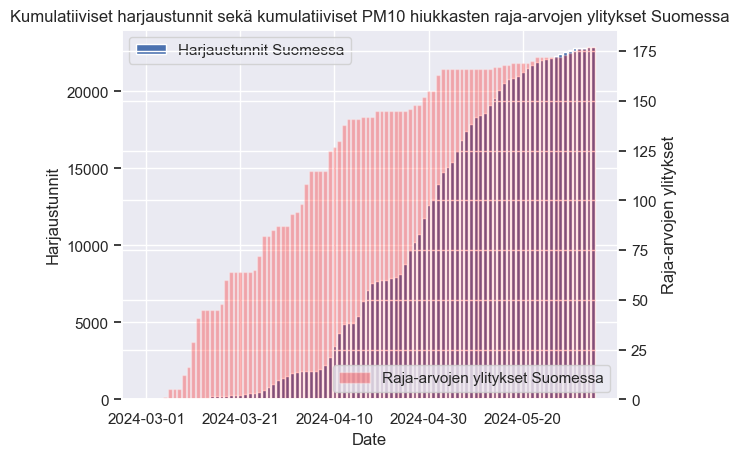

Kuvio 12. Kumulatiiviset harjaustunnit sekä kumulatiiviset PM10 hiukkasten raja-arvojen ylitykset Suomessa.

Luotettavampien johtopäätöksien tekemiseksi ylityksiä tuottaneita asemia ja harjaustunteja pyrittiin tarkastelemaan. Tämä ei kuitenkaan tuottanut luotettavia tuloksia, sillä havaintoasemien sijainti suhteessa runsasliikenteisiin väyliin tai muihin hiukkaspäästöjä tuottaviin lähteisiin vaihtelee liian huomattavasti.

### Aiemmat vuodet

Aiempien vuosien raja-arvojen ylityksiä pyrittiin myös tarkastelemaan, mikäli vuoden 2024 raja-arvojen ylityksissä tai ilmanlaadussa olisi jotain poikkeuksellista. Kuviossa 13 on kuvattu raja-arvojen ylitykset hiukkastyypeittäin vuodesta 2018 eteenpäin sekä keskeneräinen vuosi 2024. Kuviosta voi huomata poikkeuksellisen korkean määrän PM2.5 ylityksiä vuodesta 2022 eteenpäin, sekä kasvavan määrän PM10 hiukkasten ylityksiä matalasta vuodesta 2020 eteenpäin. Katupölyn vähäisen vaikutuksen ja huomattavan vaihtelun takia tutkimus keskittyy PM10 hiukkasiin.

Pienhiukkasten korkeita vuorokausipitoisuuksia aiheuttavat esimerkiksi kaukokulkeumat. Esimerkiksi useita pienhiukkasten raja-arvoja sisältäneenä vuonna 2022 pääkaupunkiseudulle saapui Itä-Euroopan maastopalojen aiheuttamia kaukokulkeumia. Kaukokulkeumat aiheuttivat vuorokauden raja-arvojen ylittymisen useana päivänä usealla asemalla. (Ilmanlaatu pääkaupunkiseudulla vuonna 2022. 2023.)

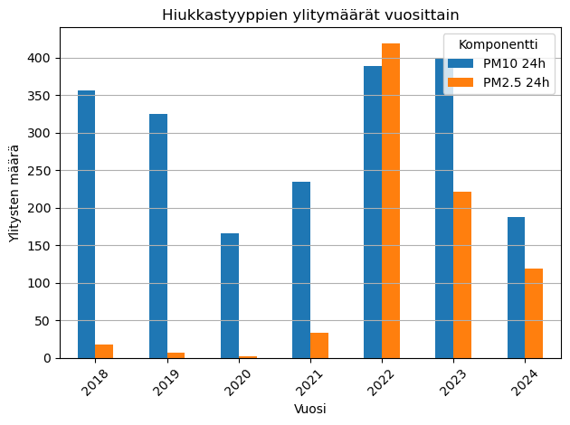

Kuvio 13. Hiukkastyyppien ylitysmäärät vuosittain.

Aiempien vuosien PM10 ylitysten sijoittumista kevätkuukausille pyrittiin myös tutkimaan. Kuviossa 13 on kuvattu PM10-hiukkasten kumulatiiviset raja-arvojen ylitykset vuodesta 2018 eteenpäin. Kuvion 14 nouseva trendi PM10 ylityksissä ei vaikuta jatkuvan, sillä ylityksiä vuosiin 2023 ja 2022 on huomattavasti vähemmän. Vuoden 2024 ylitysten ajankohta vaikuttaa myös vastaavan aiempia vuosia.

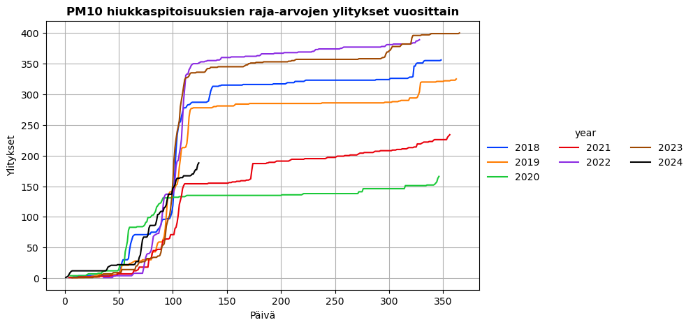

Kuvio 14. PM10 hiukkaspitoisuuksien raja-arvojen ylitykset vuosittain.

## Ilmanlaatu havaintoasemilla

Hiukkaspitoisuuksien raja-arvojen ylitysten tutkiminen ei tuottanut riittävän selviä johtopäätöksiä harjauksen vaikutuksesta ilmanlaatuun. Harjausdataa olisi vaadittu useammalta vuodelta riittävien johtopäätöksien tekemiseen, joten raja-arvojen ylitysten lisäksi ilmanlaatua tarkasteltiin yksittäisillä havaintoasemilla. Yksittäisiä havaintoasemia tarkastelemalla ilmiötä pyrittäisiin tarkastelemaan yksityiskohtaisemmin huomioiden paremmin muut ilmanlaatuun vaikuttavat tekijät, kuten sään ja liikenteen.

### Harjausdatan yhdistäminen havaintoasemaan

Havaintoaseman ympärille luotiin kilometrin säde GeoPandasin buffer-metodilla, jota verrattiin tallennettuihin reitteihin intersects- ja within-metodeilla. Tämän lisäksi reitit luokiteltiin tarkemmin etäisyyden mukaan 1000m, 500m ja 100m etäisyyksiin. Reittien hakemisen toiminta ja sisältö tarkastettiin manuaalisesti vertailemalla koordinaattipisteitä ja visualisoimalla reitit GeoPandasilla havaintoaseman ympärille. Kuviossa 15 on kuvattu Jyväskylän Jyskän havaintoaseman reitit. Kuvion reittien värit luokittelevat reitin 1000m, 500m ja 100m säteisiin.

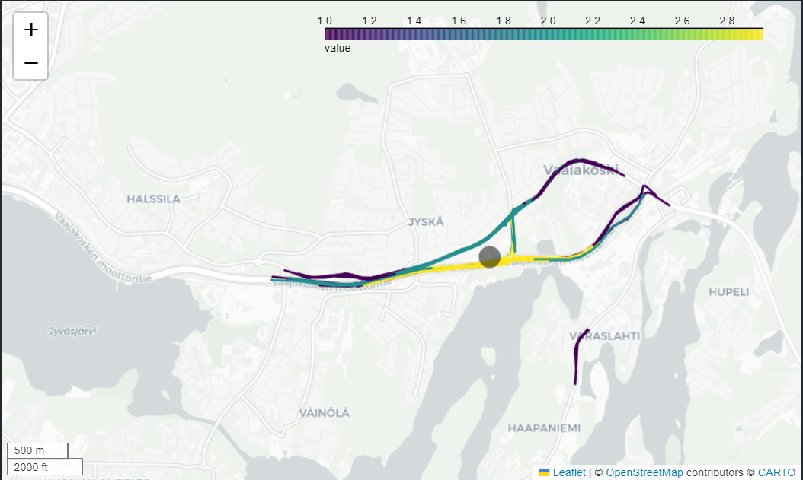

Kuvio 15. Jyväskylä, Jyskä reitit visualisoitu etäisyyden mukaan havaintoasemasta.

### Tutkittavat havaintoasemat

Harjausreittien vaikutusta ilmanlaatuun alettiin tutkia muutamalla yksittäisellä asemalla, mutta asemien määrää lisättiin, kun oli havaittavissa harjausreittien sijoittuminen vain muutamalle päivälle koko kevään ajalta ja harjauksen epäselvä vaikutus PM10-pitoisuuksiin. Tämän lisäksi tutkimista rajasi alkukeväästä asemien vähäisyys joiden lähettyvillä ylipäätään oli reittejä. Asemat valittiin Suomen kymmenestä suurimmasta kaupungista asukasluvun mukaan valikoiden runsasliikenteisiä väyliä ilman harjausreittien määrään huomioimista.

Valitut asemat (reittien haku asemille käyttää tarkempia koordinaatteja):

| Nimi                      | FMISID | LPNN | WMO | Lat   | Lon   | Korkeus | Ryhmät                 | Alkaen |
| ------------------------- | ------ | ---- | --- | ----- | ----- | ------- | ---------------------- | ------ |
| Espoo Lintuvaara 2        | 104084 |      |     | 60.24 | 24.81 |         | ilmanlaatu (kaupungit) | 2015   |
| Helsinki Teollisuuskatu   | 108068 |      |     | 60.2  | 24.94 | 18      | ilmanlaatu (kaupungit) | 2024   |
| Jyväskylä Hannikaisenkatu | 106796 |      |     | 62.24 | 25.75 |         | ilmanlaatu (kaupungit) | 2018   |
| Kuopio Savilahti KYS      | 106954 |      |     | 62.9  | 27.65 | 102     | ilmanlaatu (kaupungit) | 2019   |
| Lahti Saimaankatu         | 103132 |      |     | 60.99 | 25.67 | 85      | ilmanlaatu (kaupungit) | 2013   |
| Oulu Keskusta 2           | 103125 |      |     | 65.01 | 25.47 | 5       | ilmanlaatu (kaupungit) | 1997   |
| Pori Paanakedonkatu       | 106420 |      |     | 61.48 | 21.81 | 2       | ilmanlaatu (kaupungit) | 2016   |
| Tampere Pirkankatu        | 103099 |      |     | 61.5  | 23.74 | 120     | ilmanlaatu (kaupungit) | 2003   |
| Turku Kauppatori 2        | 107569 |      |     | 60.45 | 22.27 | 5       | ilmanlaatu (kaupungit) | 2022   |
| Vantaa hämeenlinnanväylä  | 104083 |      |     | 60.27 | 24.87 | 29      | ilmanlaatu (kaupungit) | 2015   |

(Ilmatieeteen laitoksen havaintoasemat. n.d.)

### Harjausreitit ja hiukkaspitoisuudet valituilla asemilla

Asemien tarkastelu aloitettiin PM10-hiukkaspitoisuuksien tarkastelulla. Kuviossa 16 on kuvattu valittujen asemien päivittäinen keskimääräinen PM10-hiukkaspitoisuus. Kuviosta ilmenee korkeat hiukkaspitoisuuspiikit maaliskuussa ja huhtikuun alkupuoliskolla, mikä tuli myös ilmi raja-arvojen ylityksiä tarkasteltaessa. Muilta osin datassa ei ilmene huomattavia poikkeuksia asemien välillä.

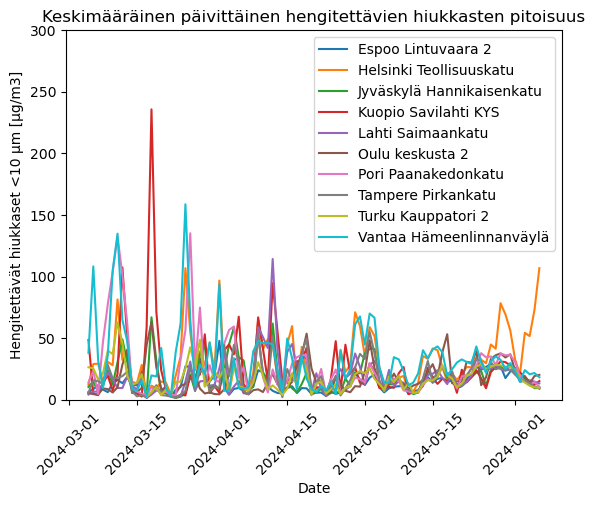

Kuvio 16. Keskimääräinen päivittäinen hengitettävien hiukkasten pitoisuus.

Reittien yhdistäminen osaksi PM10-dataa toteutettiin lataamalla 1000m säteellä olevat reitit jokaiselle valitulle asemalle. Käytettävä ilmanlaatudata sisälsi tuntihavaintoja jokaiselta asemalta, joten reittidata tulisi muuttaa tuntihavainto muotoon. Reittien tuntihavainnoista päätettiin käyttää totuusarvoja havaintoaseman säteille. Reittidatan tarkastelu oli tuonut ilmi reitteihin käytettävän ajan heikkoudet, sillä harjaustunteja saattoi kertyä runsaasti ajoneuvon ollessa paikallaan tai pyöriessä esimerkiksi parkkipaikalla, joten PM10-pitoisuuksiin tultaisiin yhdistämään vain sädealueiden totuusarvot. Ilmatieteen laitoksen tuntihavainnot sisälsivät edellisen tunnin keskiarvot, joka siirrettiin seuraavalle tunnille, sillä harjausdatan totuusarvot asetetettiin aina alkavalle tunnille. Lopulta saatiin kevätkuukausien ilmanlaatuhavainnot ja reittidatan totuusarvot yhdistettyä kaikille asemille yhteen dataframeen, jossa aikaleima viittaa alkavaan tuntiin.

<div>
<table border="1" class="dataframe">
  <thead>
    <tr style="text-align: right;">
      <th></th>
      <th>Havaintoasema</th>
      <th>Vuosi</th>
      <th>Kuukausi</th>
      <th>Päivä</th>
      <th>Aika [UTC]</th>
      <th>Hengitettävät hiukkaset &lt;10 µm [µg/m3]</th>
      <th>Date</th>
      <th>1000m</th>
      <th>500m</th>
      <th>100m</th>
    </tr>
  </thead>
  <tbody>
    <tr>
      <th>0</th>
      <td>Espoo Lintuvaara 2</td>
      <td>2024</td>
      <td>3</td>
      <td>5</td>
      <td>00:00</td>
      <td>6.4</td>
      <td>2024-03-05 00:00:00</td>
      <td>0</td>
      <td>0</td>
      <td>0</td>
    </tr>
    <tr>
      <th>1</th>
      <td>Espoo Lintuvaara 2</td>
      <td>2024</td>
      <td>3</td>
      <td>5</td>
      <td>01:00</td>
      <td>4.6</td>
      <td>2024-03-05 01:00:00</td>
      <td>0</td>
      <td>0</td>
      <td>0</td>
    </tr>
    <tr>
      <th>2</th>
      <td>Espoo Lintuvaara 2</td>
      <td>2024</td>
      <td>3</td>
      <td>5</td>
      <td>02:00</td>
      <td>4.1</td>
      <td>2024-03-05 02:00:00</td>
      <td>0</td>
      <td>0</td>
      <td>0</td>
    </tr>
    <tr>
      <th>3</th>
      <td>Espoo Lintuvaara 2</td>
      <td>2024</td>
      <td>3</td>
      <td>5</td>
      <td>03:00</td>
      <td>3.8</td>
      <td>2024-03-05 03:00:00</td>
      <td>0</td>
      <td>0</td>
      <td>0</td>
    </tr>
    <tr>
      <th>4</th>
      <td>Espoo Lintuvaara 2</td>
      <td>2024</td>
      <td>3</td>
      <td>5</td>
      <td>04:00</td>
      <td>3.5</td>
      <td>2024-03-05 04:00:00</td>
      <td>0</td>
      <td>0</td>
      <td>0</td>
    </tr>
    <tr>
      <th>...</th>
      <td>...</td>
      <td>...</td>
      <td>...</td>
      <td>...</td>
      <td>...</td>
      <td>...</td>
      <td>...</td>
      <td>...</td>
      <td>...</td>
      <td>...</td>
    </tr>
    <tr>
      <th>2251</th>
      <td>Vantaa Hämeenlinnanväylä</td>
      <td>2024</td>
      <td>6</td>
      <td>6</td>
      <td>19:00</td>
      <td>10.6</td>
      <td>2024-06-06 19:00:00</td>
      <td>0</td>
      <td>0</td>
      <td>0</td>
    </tr>
    <tr>
      <th>2252</th>
      <td>Vantaa Hämeenlinnanväylä</td>
      <td>2024</td>
      <td>6</td>
      <td>6</td>
      <td>20:00</td>
      <td>9.7</td>
      <td>2024-06-06 20:00:00</td>
      <td>0</td>
      <td>0</td>
      <td>0</td>
    </tr>
    <tr>
      <th>2253</th>
      <td>Vantaa Hämeenlinnanväylä</td>
      <td>2024</td>
      <td>6</td>
      <td>6</td>
      <td>21:00</td>
      <td>13</td>
      <td>2024-06-06 21:00:00</td>
      <td>0</td>
      <td>0</td>
      <td>0</td>
    </tr>
    <tr>
      <th>2254</th>
      <td>Vantaa Hämeenlinnanväylä</td>
      <td>2024</td>
      <td>6</td>
      <td>6</td>
      <td>22:00</td>
      <td>15.7</td>
      <td>2024-06-06 22:00:00</td>
      <td>0</td>
      <td>0</td>
      <td>0</td>
    </tr>
    <tr>
      <th>2255</th>
      <td>Vantaa Hämeenlinnanväylä</td>
      <td>2024</td>
      <td>6</td>
      <td>6</td>
      <td>23:00</td>
      <td>NaN</td>
      <td>2024-06-06 23:00:00</td>
      <td>0</td>
      <td>0</td>
      <td>0</td>
    </tr>
  </tbody>
</table>
<p>22548 rows × 10 columns</p>
</div>

Valituista asemista jokainen ei kuitenkaan sisältänyt reittejä ja reittejä sisältävistä asemista kaikki eivät sisältäneet reittejä kaikilta sädealueilta. Kuviossa 17 on kuvattu keskimääräiset hengitettävät hiukkaset alkavalla tunnilla jokaiselle valitulle asemalle. Kuviosta voi nähdä osan asemista sisältävän 0 reittiä ja esimerkiksi 100m säteellä olevia reittejä on vain neljällä asemalla. Ainoa merkittävä huomio on 100m säteellä olevien reittien mahdollinen vaikutus Vantaan Hämeenlinnanväylän hiukkaspitoisuuksiin. Tuntikohtaisessa tarkastelussa täytyy kuitenkin huomioida harjaustuntien sijoittuminen melko usein päiväsaikaan, jolloin ilmanlaatu on yötä heikompi.

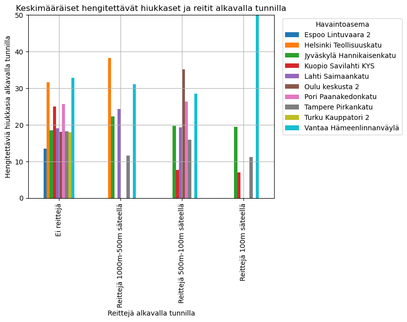

Kuvio 17. Keskimääräiset hengitettävät hiukkaset ja reitit alkavalla tunnilla.

Tuntihavaintojen lisäksi luotiin päivittäisiä havaintoja sisältävä dataframe, jossa ilmanlaatu on päivittäinen keskiarvo ja reitit sädealueiden sisällä olevien alkavien tuntien määrä kyseisenä vuorokautena. Kuviossa 18 on kuvattu päivittäiset hengitettävien hiukkasten pitoisuudet valituilta asemilta ja kyseisenä päivänä tapahtuneet reitit. Mikäli reittejä on useammalta sädealueelta, kuvataan päivä pienimmän sädealueen mukaan. Korkeita hiukkaspitoisuuksia ilmenee monena harjauspäivänä, mutta piikkejä ilmenee myös reittejä sisältämättöminä päivinä. Selvää hiukkaspitoisuuksien laskua ei ole juuri harjauksen jälkeen, vaan useammalla asemalla hiukkaspitoisuuspiikit vähenevät huhtikuun puolivälin jälkeen.

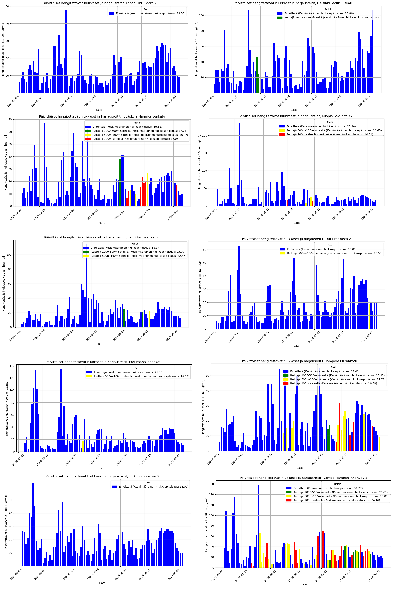

Kuvio 18. Päivittäiset hengitettävät hiukkaset ja harjausreitit

Päivittäisten havaintojen lisäksi tutkittiin tuntikohtaisia havaintoja harjausdataa sisältäviltä päiviltä. Kuviossa 19 on kuvattu esimerkiksi Helsingin Teollisuuskadun havaintoaseman vuorokauden reitit 01.04.2024, joka näyttäytyy aiemmassa kuviossa korkean hiukkaspitoisuuden päivänä. Harjausreitillä ei kuitenkaan vaikuta olevan vaikutusta ilmanlaatuun kyseisenä päivänä, kuten ei monena muunakaan tarkasteltuna päivänä.

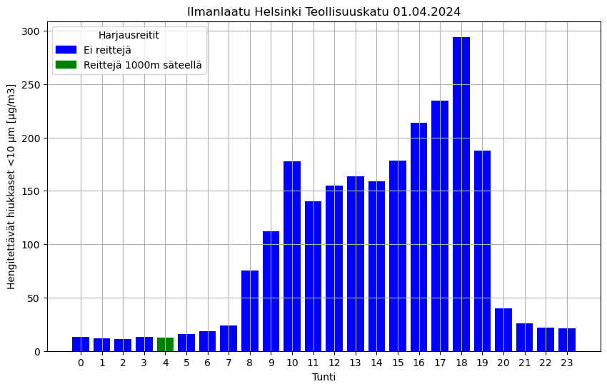

Kuvio 19. Ilmanlaatu Helsinki Teollisuuskatu 01.04.2024.

Hengitettävien hiukkasten pitoisuuden ja harjausreittien välistä laskennallista tai muuten havaittavissa olevaa korrelaatiota tai vaikutusta ei onnistuttu löytämään. Tämä ei kuitenkaan poissulje tämän vaikutuksen tai korrelaation mahdollisuutta. Tämän lisäksi harjauksella voi olla vaikutus suurten hiukkasten pitoisuuksiin harjauksen aikana ja sen jälkeen.

## Muut vaikuttavat tekijät

### Sää

Sään vaikutusta pidettiin yhtenä merkitsevimpänä tekijänä ilmanlaatuun. Sään vaikutusta tarkasteltiin yksittäisillä asemilla huomioiden eri suureiden poikkevat vaikutukset. Ilmiöt pyrittiin vahvistamaan useammalla asemalla ja ilmiöitä tarkasteltiin vain kevätkuukausilta. Kuviossa 20 on tarkasteltu hengitettävien hiukkasten korrelaatiota eri havaintosuureisiin eri aikaväleillä. Mielenkiintoisin ilmiö oli sateen heikko korrelaatio hengitettäviin hiukkasiin.

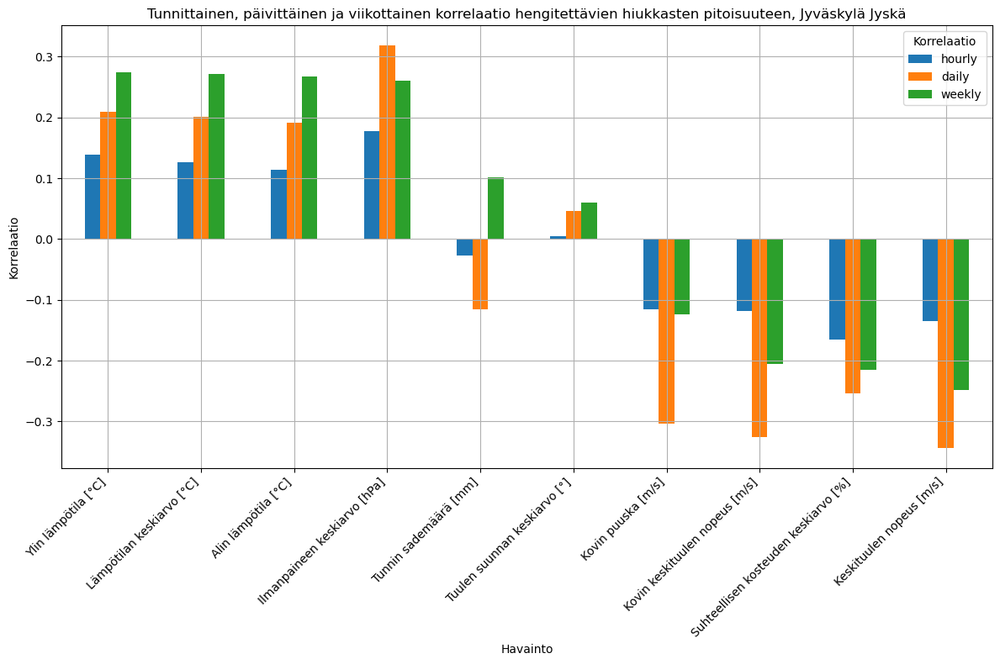

Kuvio 20. Tunnittainen, päivittäinen ja viikottainen korrelaatio hengitettävien hiukkasten pitoisuuteen, Jyväskylä Jyskä.

Sateen vaikutusta pyrittiin tarkastelemaan vielä erikseen. Heikon korrelaation voisi selittää havaintosuureen yleiset 0-arvot verrattuna muihin suureisiin sekä epäselvä merkitys sateen varsinaisella määrällä. Sateen vaikutusta tarkasteltiin siis kumulatiivisesti ja totuusarvoin. Merkittävimmän negatiivisen korrelaation hengitettävien hiukkasten pitoisuuteen tuottikin useamman päivän kumulatiivinen sademäärä totuusarvoina.

-   Sademäärän korrelaatio totuusarvona: -0.1661831939880597
-   2 päivän kumulatiivisen sademäärän korrelaatio totuusarvona: -0.255386503364348
-   3 päivän kumulatiivisen sademäärän korrelaatio totuusarvona: -0.36429096495679775
-   4 päivän kumulatiivisen sademäärän korrelaatio totuusarvona: -0.3844944210784609
-   5 päivän kumulatiivisen sademäärän korrelaatio totuusarvona: -0.30323875700831027
-   6 päivän kumulatiivisen sademäärän korrelaatio totuusarvona: -0.23918111093588865
-   7 päivän kumulatiivisen sademäärän korrelaatio totuusarvona: -0.26120830490340236

### Liikenne

Hiukkaspitoisuuksien raja-arvojen ylityksiä tarkasteltaessa tieliikennettä pidettiin useimmiten syynä heikolle ilmanlaadulle, joten yksittäisten havaintoasemien liikennemäärien ja hiukkaspitoisuuksien korrelaatiota pyrittiin tutkimaan. Liikenteen vaikutusta ilmanlaatuun pyrittiin tutkimaan vain harjausdatan tallennusajalta eli kevätkuukausilta. Datan tarkastelu rajattiin pelkästään liikennemäärien tarkasteluun.

**Valitut LAM-asemat**
| Nimi | LAM-asema | LAM-aseman tiedot |
| ------------------------- | ------ |----|
| Jyväskylä Jyska | 923 |Viereisen runsasliikenteisen väylän liikenne. Ei itse Hannikaisenkadun liikenne. |
| Jyväskylä Hannikaisenkatu | 938 |Viereinen moottoritie, etäisyyttä alle 100m|

Tuntikohtaisten ja päiväkohtaisen hiukkaspitoisuuksien ja liikennemäärien tarkastelu ei tuottanut laskennallisesti merkittävää korrelaatiota. Kuviosta 21 on kuitenkin havaittavissa arkipäivinä korkeampi liikenne ja useimmiten viikonloppuja korkeampi hiukkaspitoisuus.

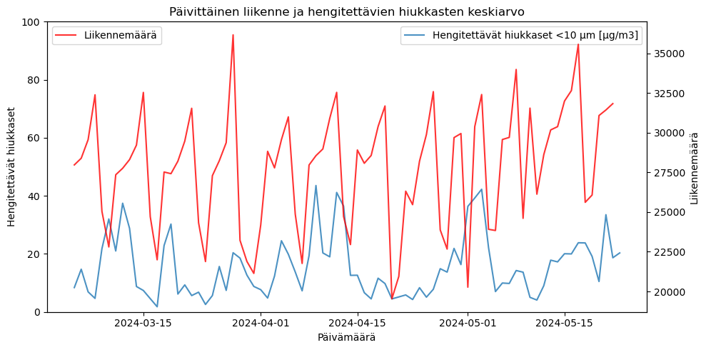

Kuvio 21. Jyväskylä, Jyskä ilmanlaatu ja liikenne.

Liikennemäärät ja hiukkaspitoisuudet pyrittiin siis luokittelemaan eri viikonpäiville. Kuviossa 22 on kuvattu keskimääräinen päivittäinen hiukkaspitoisuus ja kokonaisliikennemäärä kyseisenä päivänä 5.3.2024-23.5.2024. Kuviosta on havaittavissa selkeästi korkeammat liikennemäärät ja hiukkaspitoisuudet arkipäivinä. Maanantain matalampi hiukkaspitoisuus selittynee sunnuntain jälkeisen aamuyön tunteina.

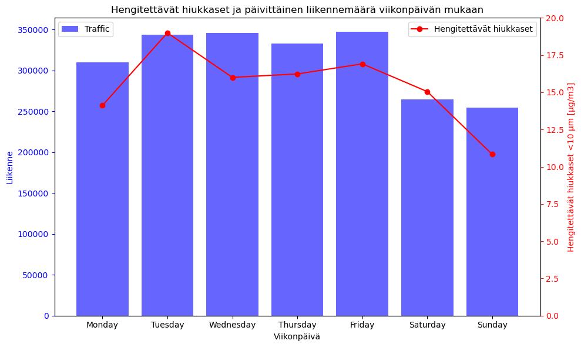

Kuvio 22. Jyväskylä, Jyskä ilmanlaatu ja liikenne viikonpäivittäin.

## Pohdinta

Raportin tavoitteena oli tutkia kunnossapidon vaikutusta ilmanlaatuun. Tutkimus rajattiin käsittelemään harjauskaluston vaikutusta hengitettäviin hiukkasiin eli PM10-hiukkasiin. Raportissa on taustoitettu ilmiötä muiden tutkimuksien löydöksillä ja muulla tietoperustalla. Tutkimus toteutettiin yhdistämällä kerätty reittidata käytettävien havaintoasemien pitoisuusmittauksiin. Tutkimuksessa ei löydetty selvää yhteyttä harjauskaluston reittien ja havaintoasemien pitoisuusmittausten välillä. Vaikka tieliikenteellä ja liikennemäärillä on selvä vaikutus hengitettävien hiukkasten pitoisuuksiin, ei tällaista välttämättä ole yksittäisellä suurempiin hiukkasiin vaikuttavalla harjauskoneella.

Tutkimuksen luotetattavuuteen ja tuloksiin vaikutti saatavilla oleva data niin ilmanlaadusta kuin harjausreiteistä. Ilmanlaatudatan osalta näkyvä ja ärtyyntyneisyyttä aiheuttava katupöly on kokoluokaltaan suurempaa kuin tutkimuksessa käytettävät PM10-hiukkaset. Tämän lisäksi suurten hiukkasten pitoisuuksiin voisi olettaa olevan merkittävämpi vaikutus harjauksella, jolla pyritään poistamaan pölyä aiheuttavaa sepeliä. Harjausdatan osalta ei ollut mahdollista erotella mahdollista siirtoajoa, eikä tarkemmasta tehtävänkuvasta, kuten erottelua parkkipaikkojen, kevyen liikenteen ja tieliikenteen välillä ollut saatavilla.

Tutkimuksen kannalta kiinnostavin jatkotutkimus olisi tutkia harjauksen vaikutusta suurten hiukkasten pitoisuuksiin. Suurten hiukkasten pitoisuuksista ei ole kuitenkaan saatavilla avointa dataa. Kevään harjausreittien aloitusajankohtaa ja sään vaikutusta tähän voisi myös tutkia mikäli dataa olisi useammalta vuodelta.

## Lähteet

Digitraffic. N.d. Digitrafficin kotisivu. Viitattu 21.5.2024. https://www.digitraffic.fi/.

Havaintojen lataus. N.d. Ilmatieteenlaitoksen latauspalvelu. Viitattu 21.5.2024. https://www.ilmatieteenlaitos.fi/havaintojen-lataus.

Hengitysilmassa on aina erikokoisia hiukkasia. N.d. HSY:n tiedote. Viitattu 19.6.2024. https://www.hsy.fi/katupoly/hengitysilman-hiukkaset/

Ilmanlaatuindeksi. N.d. Ilmatieteen laitoksen sivu. Viitattu 21.5.2024. https://www.ilmatieteenlaitos.fi/ilmanlaatuindeksi.

Ilmanlaatu pääkaupunkiseudulla vuonna 2022. 2023. HSY:n tiedote. Viitattu 25.6.2024. https://julkaisu.hsy.fi/ilmanlaatu-paakaupunkiseudulla-vuonna-2022/5.html

Ilmanlaadun säädökset. N.d. Ilmatieteen laitoksen sivu. Viitattu 25.6.2024. https://www.ilmatieteenlaitos.fi/saadokset-ja-ohjeet

Ilmatieteen laitoksen havaintoasemat. N.d. Viitattu 18.6.2024. https://www.ilmatieteenlaitos.fi/havaintoasemat

Ilmatieteen laitos - turvaa ja sujuvuutta yhteiskunnalle. N.d. Ilmatieteen laitoksen sivu. Viitattu 21.5.2024. https://www.ilmatieteenlaitos.fi/ilmatieteen-laitos.

Kuopion seudun ilmanlaatu vuonna 2021. 2022. JPP-Kalibrointi Ky. Viitattu 22.5.2024. https://www.kuopio.fi/uploads/2023/04/kuopion-seudun-ilmanlaatu-vuonna-2021.pdf.

Lisätietoa havaintosuureista. N.d. Tietoa Ilmatieteen laitoksen havaintosuureista. Viitattu 21.5.2024. https://www.ilmatieteenlaitos.fi/lisatietoa-havaintosuureista.

Pitoisuusylitykset. N.d. Porin kaupungin verkkosivu. Viitattu 22.5.2024. https://www.pori.fi/asuminen-ja-ymparisto/ymparisto/ilmanlaadun-seuranta/ajankohtaista-porin-ja-harjavallan-alueen-ilmanlaadun-seurannassa-2022/pitoisuusylitykset/

Pärjälä, O. 2023. Ilmanlaadun mittausten vuosiraportti. Jyväskylän ilmanlaatu vuonna 2022. Versio 1.1. Aeri Oy. https://www.jyvaskyla.fi/sites/default/files/2023-05/Jyvaskylan_ilmantarkkailun_vuosiraportti_2022.pdf.

Ritola, R., Kulovuori, S., Stojulkovic, A., Karvosenoja, N. 2021. Katupölyn lähteet, päästövähennyskeinot ja ilmanlaatuvaikutukset. KALPA3-tutkimushankkeen loppuraportti. Suomen ympäristökeskus. Viitattu 21.5.2024. https://www.kuopio.fi/uploads/2023/04/katupolyn-lahteet-paastovahennyskeinot-ja-ilmanlaatuvaikutukset-kalpa-3.pdf.

Siponen, T., Taimisto, P., Yli-Tuomi, T., Salonen, R.O. 2021. Kuopion katupölytutkimus 2019. Hankkeen loppuraportti. Viitattu 24.6.2024. https://www.kuopio.fi/uploads/2023/04/kuopion-katupolytutkimus-2019.pdf

Tieliikenne N.d. Avointa dataa Suomen tieverkolta. Viitattu 13.6.2024. https://www.digitraffic.fi/tieliikenne/

Uusimmat ylitykset. 2024. Ilmatieteenlaitoksen verkkosivu. Viitattu 22.5.2024. https://www.ilmatieteenlaitos.fi/ilmanlaadun-uusimmat-ylitykset.
