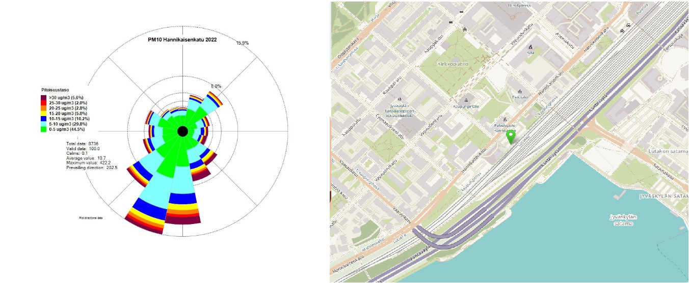

# Muut tutkimukset

## Katupölyn lähteet, päästövähennyskeinot ja ilmanlaatuvaikutukset

### KALPA3-tutkimushankkeen loppuraportti

https://www.kuopio.fi/uploads/2023/04/katupolyn-lahteet-paastovahennyskeinot-ja-ilmanlaatuvaikutukset-kalpa-3.pdf

Huomiot:

-   Katupölypäästöt 34% PM10-kokonaispäästöistä ja 5,5 % PM2,5- kokonaispäästöistä Suomessa vuonna 2015.
-   Katupöly pääosin yli PM2,5
-   Pölyn koostumus hiekoitushiekkaa ja päällystettä
-   Nastarenkaiden vaikutus
-   Pölynsidonnan vaikutus
-   Erilaisten lakaisulaitteiden vaikutus (vedelliset/vedettömät)

## Kuopion katupölytutkimus 2019

### Hankkeen loppuraportti

https://www.kuopio.fi/uploads/2023/04/kuopion-katupolytutkimus-2019.pdf

Huomiot:

-   Kävelijän altistuminen on selvästi korkeampi kuin mittausaseman mittaukset

## ILMANLAADUN MITTAUSTEN VUOSIRAPORTTI

### 2022 Jyväskylä

Huomiot:

-   Mittausemien tarkastelu edellisen tutkimuksen takia
-   Mittauskorkeus 3m tai 3,5m
-   Ei välttämättä vastaa kävelijän altistumista sijainnin osalta
-   Hiukkasten pitoisuudet eri suunnilla eroavat huomattavasti

https://www.jyvaskyla.fi/sites/default/files/2023-05/Jyvaskylan_ilmantarkkailun_vuosiraportti_2022.pdf

Katupölyn tutkimusmenetelmät
https://www.syke.fi/fi-FI/Tutkimus__kehittaminen/Tutkimus_ja_kehittamishankkeet/Hankkeet/Katupolytutkimus/Katupolyn_tutkimusmenetelmat

Suuret hiukkaset
https://www.hsy.fi/katupoly/hengitysilman-hiukkaset/
